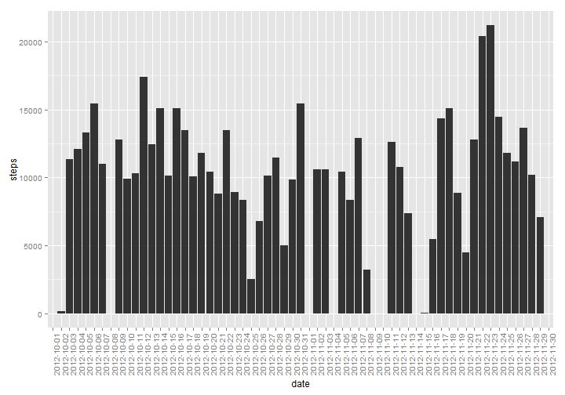
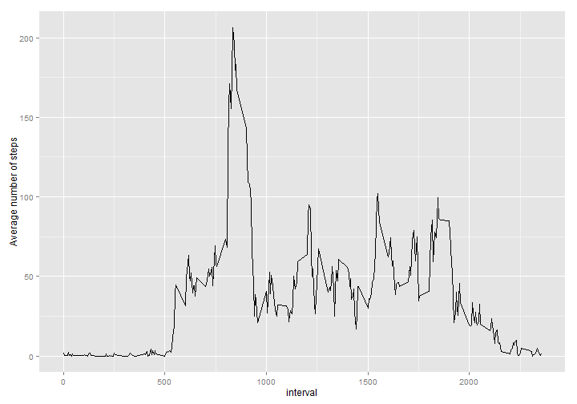
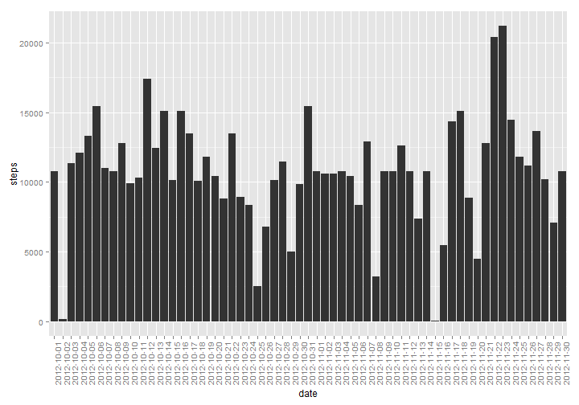
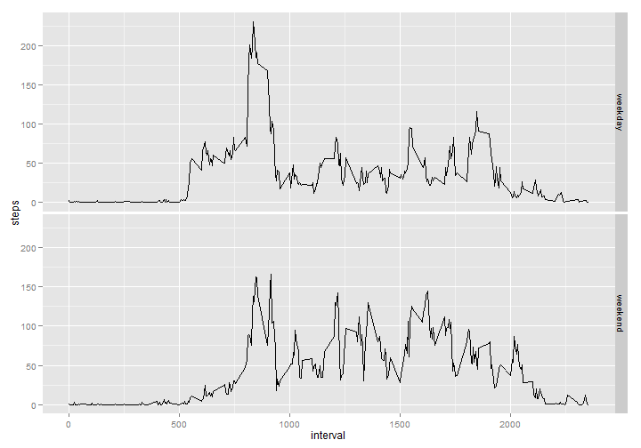

Reproducible Research Peer Assessment 1
========================================================

At first we will load our data. Like this:


```r
my_data <- read.csv("activity.csv")
```

Then look at what we have got:


```r
str(my_data)
```

```
## 'data.frame':	17568 obs. of  3 variables:
##  $ steps   : int  NA NA NA NA NA NA NA NA NA NA ...
##  $ date    : Factor w/ 61 levels "2012-10-01","2012-10-02",..: 1 1 1 1 1 1 1 1 1 1 ...
##  $ interval: int  0 5 10 15 20 25 30 35 40 45 ...
```

```r
head(my_data)
```

```
##   steps       date interval
## 1    NA 2012-10-01        0
## 2    NA 2012-10-01        5
## 3    NA 2012-10-01       10
## 4    NA 2012-10-01       15
## 5    NA 2012-10-01       20
## 6    NA 2012-10-01       25
```

Nothing intriguing, so let's proceed to the first task.

### 1) What is mean total number of steps taken per day?

#### 1) Make a histogram of the total number of steps taken each day
Perhaps it is possible to create such diagram from the source data in one step, but I am not yet as good in R, so I make helper dataframe at first.


```r
tspd <- with( my_data, tapply(steps, date, sum, na.rm = TRUE) )
```

Our result, *tspd* (meaning *total steps per day*), is of type *list*, and completely useless for building  plots. So, one more transformation.


```r
tspd <- data.frame( steps = as.vector(unlist(tspd)), date = dimnames(tspd)[[1]] )
```

Now we are ready to build the plot, here it is:


```r
library(ggplot2)
ggplot(tspd) + aes(date, weight = steps) + geom_bar() + scale_y_continuous("steps") +
  theme( axis.text.x = element_text(angle = 90, hjust = 1) )
```

 

#### 2) Calculate and report the __mean__ and __median__ total number of steps taken per day.

It is no hard task.


```r
my_mean <- mean(tspd$steps)
my_median <- median(tspd$steps)
print( sprintf( "The mean is %f, the median is %f", my_mean, my_median))
```

```
## [1] "The mean is 9354.229508, the median is 10395.000000"
```

Thus the mean is 9354.2295 and the median 10395.

### 2) What is the average daily activity pattern?

#### 1) Make a time series plot (i.e. type = "l") of the 5-minute interval (x-axis) and the average number of steps taken, averaged across all days (y-axis).

Again, at first we create new dataframe.


```r
spi <- data.frame(interval = unique(my_data$interval))
spi$avg <- with(my_data, as.vector(unlist(tapply(steps, interval, mean, na.rm = TRUE))))
ggplot(spi) + aes(interval, avg) + geom_line() +
  scale_y_continuous("Average number of steps")
```

 

Here *spi* means *steps per interval*, *avg* is *average number of steps*.

#### 2) Which 5-minute interval, on average across all the days in the dataset, contains the maximum number of steps?

What could be more easy?


```r
val <- spi[which.max(spi$avg),]
my_rowname <- rownames(val)
my_interval <- val$interval
my_avg <- val$avg
val
```

```
##     interval   avg
## 104      835 206.2
```

We can see, that interval 835 having place at row 104 contains maximum number of steps (206.1698).

### 3) Imputing missing values

#### 1) Calculate and report the total number of missing values in the dataset (i.e. the total number of rows with NAs)

Do I need to comment this?


```r
my_missing_sum <- sum( is.na(my_data$steps) )
my_missing_sum
```

```
## [1] 2304
```

There are 2304 missing values in the dataset.

#### 2) Devise a strategy for filling in all of the missing values in the dataset. The strategy does not need to be sophisticated. For example, you could use the mean/median for that day, or the mean for that 5-minute interval, etc.

I think that the second suggestion is good enough, the mean for that 5-minute interval across all days.

#### 3) Create a new dataset that is equal to the original dataset but with the missing data filled in.


```r
#for indexing by interval
rownames(spi) <- spi$interval
#creating copy of the dataframe
copy_data <- my_data
#adding new column which will contain imputed values of missing data
copy_data$good_steps <- copy_data$steps
#memorizing which step values are bad
bad_steps <- is.na(copy_data$steps)
#vector of missing value intervals, to be used as indices for spi
ind <- as.character(copy_data[bad_steps, "interval"])
#filling with means from spi
copy_data$good_steps[bad_steps] <- spi[ind,"avg"]
```

#### 4) Make a histogram of the total number of steps taken each day and Calculate and report the mean and median total number of steps taken per day. Do these values differ from the estimates from the first part of the assignment? What is the impact of imputing missing data on the estimates of the total daily number of steps?

So let's append new column to the dataframe from the first task.


```r
tspd$new_steps <- as.vector( unlist(with(copy_data, tapply(good_steps, date, sum, na.rm = TRUE))) )
my_new_mean <- mean(tspd$new_steps)
my_new_median <- median(tspd$new_steps)
print(sprintf( "New mean is %f and the median is %f", my_new_mean, my_new_median))
```

```
## [1] "New mean is 10766.188679 and the median is 10766.188679"
```

Thus the mean and median values of our new dataset are 1.0766 &times; 10<sup>4</sup> and 1.0766 &times; 10<sup>4</sup> accordingly (against 9354.2295 and 10395 of the original dataset). Both values increased, and both values are the same, as we can see.

Here is the histogram:


```r
ggplot(tspd) + aes(date, weight = new_steps) + geom_bar() + scale_y_continuous("steps") +
  theme( axis.text.x = element_text(angle = 90, hjust = 1) )
```

 


### 4) Are there differences in activity patterns between weekdays and weekends?

#### 1) Create a new factor variable in the dataset with two levels b


```r
#create new column with default value "weekday"
copy_data$day_type <- rep ( "weekday", length(copy_data$date) )
#my locale is not english and it fails to detect Sunday and Saturday among weekdays
#so need to reset to default
Sys.setlocale("LC_ALL", 'C')
```

```
## [1] "C"
```

```r
#now detect weekends
weekends <- weekdays(as.Date(copy_data$date)) %in% c("Sunday","Saturday")
copy_data$day_type[weekends] <- "weekend"
#convert to factor
copy_data$day_type <- as.factor(copy_data$day_type)
#look at the result
table(copy_data$day_type)
```

```
## 
## weekday weekend 
##   12960    4608
```

#### 2) Make a panel plot containing a time series plot (i.e. type = "l") of the 5-minute interval (x-axis) and the average number of steps taken, averaged across all weekday days or weekend days (y-axis).


```r
#spibd - steps per interval grouped by daytype
spibd <- with(copy_data, tapply(good_steps, list(interval, day_type), mean ))
library(reshape2)
#plots work with melted data
spibd <- melt( spibd )
names(spibd) <- c("interval", "day_type", "steps")
#let's draw it!
ggplot(spibd) + aes(interval, steps) + geom_line() + facet_grid(day_type ~ .)
```

 
